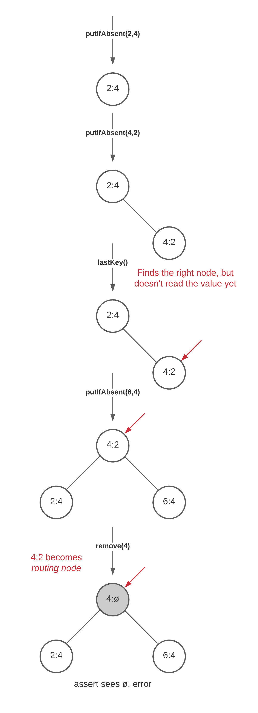

# Bugs found in tested algorithms

## [SnapTreeMap](../src/SnapTree/SnapTreeMap.java)

[Lincheck](https://github.com/Kotlin/kotlinx-lincheck) found error while executing following scenario:
```
Execution scenario (init part):
[putIfAbsent(2, 4), putIfAbsent(4, 2)]
Execution scenario (parallel part):
| putIfAbsent(6, 4) | lastKey() |
| remove(4)         |           |
```

The following interleaving leads to the error:
```
Parallel part trace:
|                      | lastKey()                                                                                                           |
|                      |   lastKey(): threw AssertionError at IntIntSnapTreeMapTest.lastKey(IntIntSnapTreeMapTest.kt:44)                     |
|                      |     extremeKeyOrThrow(R): threw AssertionError at SnapTreeMap.lastKey(SnapTreeMap.java:645)                         |
|                      |       extreme(true,R): threw AssertionError at SnapTreeMap.extremeKeyOrThrow(SnapTreeMap.java:654)                  |
|                      |         holderRef.READ: COWMgr@1 at SnapTreeMap.extreme(SnapTreeMap.java:666)                                       |
|                      |         read(): RootHolder@1 at SnapTreeMap.extreme(SnapTreeMap.java:666)                                           |
|                      |         right.READ: Node@1 at SnapTreeMap.extreme(SnapTreeMap.java:666)                                             |
|                      |         shrinkOVL.READ: 0 at SnapTreeMap.extreme(SnapTreeMap.java:670)                                              |
|                      |         holderRef.READ: COWMgr@1 at SnapTreeMap.extreme(SnapTreeMap.java:674)                                       |
|                      |         read(): RootHolder@1 at SnapTreeMap.extreme(SnapTreeMap.java:674)                                           |
|                      |         right.READ: Node@1 at SnapTreeMap.extreme(SnapTreeMap.java:674)                                             |
|                      |         attemptExtreme(true,R,Node@1,0): threw AssertionError at SnapTreeMap.extreme(SnapTreeMap.java:676)          |
|                      |           child(R): Node@2 at SnapTreeMap.attemptExtreme(SnapTreeMap.java:691)                                      |
|                      |           shrinkOVL.READ: 0 at SnapTreeMap.attemptExtreme(SnapTreeMap.java:708)                                     |
|                      |           child(R): Node@2 at SnapTreeMap.attemptExtreme(SnapTreeMap.java:716)                                      |
|                      |           shrinkOVL.READ: 0 at SnapTreeMap.attemptExtreme(SnapTreeMap.java:723)                                     |
|                      |           attemptExtreme(true,R,Node@2,0): threw AssertionError at SnapTreeMap.attemptExtreme(SnapTreeMap.java:727) |
|                      |             child(R): null at SnapTreeMap.attemptExtreme(SnapTreeMap.java:691)                                      |
|                      |             switch                                                                                                  |
| putIfAbsent(6, 4)    |                                                                                                                     |
| remove(4)            |                                                                                                                     |
|   thread is finished |                                                                                                                     |
|                      |             vOpt.READ: null at SnapTreeMap.attemptExtreme(SnapTreeMap.java:697)                                     |
|                      |             shrinkOVL.READ: 0 at SnapTreeMap.attemptExtreme(SnapTreeMap.java:699)                                   |
```

We can see that one of asserts fails:
```
java.lang.AssertionError
	at SnapTree.SnapTreeMap.attemptExtreme(SnapTreeMap.java:703)
```

Visualization of the error:


That is, it turns out that if there was no `remove(4)`, everything would be fine, because it would just turn out that `lastKey()` seemed to be executed earlier than `putIfAbsent(6,4)`. If there was no `putIfAbsent(6,4)`, there would also be no error, because the 4:2 node would have been cut out of the tree, but the value in it would not have changed. In our case, the node cannot be cut out of the tree due to the *partial external tree* approach, so it is simply marked as a routing node, which is why `assert` is triggered.

There is no mistake directly in the article, because it says:
>Readers ‘optimistically’ assume that no mutation will occur during a critical region, and then retry if that assumption fails.

Therefore, if we take this case into account in the implementation and make a check instead of `assert` and, if necessary, retry, then this error ceases to occur.

For more information check [IntIntSnapTreeMap](IntIntSnapTreeMap).

## [LogicalOrderingAVL](../src/LogicalOrderingAVL/LogicalOrderingAVL.java)

[Lincheck](https://github.com/Kotlin/kotlinx-lincheck) found deadlock while executing following scenario:
```
Execution scenario (init part):
[put(5, 3)]
Execution scenario (parallel part):
| putIfAbsent(3, 8) | put(1, 7) | remove(3) |
```

For interleaving and other information please check [IntIntLogicalOrderingAVL](IntIntLogicalOrderingAVL).

Here is a brief description of the reason for the resulting hang:

Initially, there are two nodes in the tree, with the keys MIN_VALUE and MAX_VALUE.
MAX_VALUE is the right child of MIN_VALUE, and MAX_VALUE is the root.
Then, during the init part, a node with the key 5 is added, it becomes the left child for MAX_VALUE.
The parallel part begins, the second thread comes, takes the locks it needs and finishes inserting the node with key 1 (it becomes the left child for 5), but does not yet release the locks, including the `treeLock` of the node with key 5, before switching.
There is a switch, and the first thread comes.
It inserts a node with the value 3 (it becomes the right child for 1), but to prepare for rebalancing the tree, it tries to take the `treeLock` of the node with the key 5.
Since the second thread holds it, it does not succeed, and the first thread starts waiting.
There is a switch, and a third thread comes, which wants to delete the node with the key 3.
To do this, it starts taking locks, including taking `treeLock` of the node with the key 3 and trying to take `treeLock` of the node with the key 1.
Since the first thread is holding it, it does not succeed, and the third thread also starts waiting.
Then the second thread releases all the locks and finishes working.
After that, the first thread successfully takes the `treeLock` of the node with the key 5, but then hangs in an infinite loop of attempts to take the `treeLock` of the node with the key 3, which is held by the third thread.
As a result, we have a deadlock, when the first and third threads are infinitely waiting for each other.